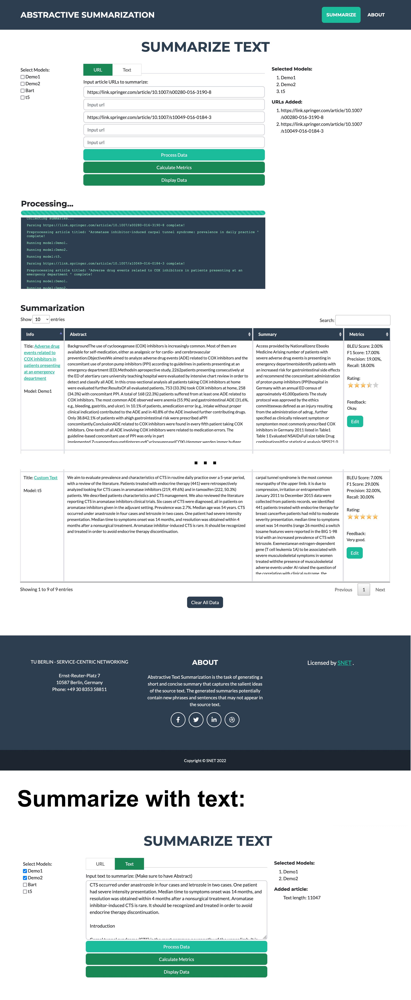

## Accurator Demo

A Flask-based web application for **comparative text summarization** with user feedback collection. This demo allows users to process articles from URLs or custom text, generate summaries using multiple AI models, and evaluate their quality through interactive feedback mechanisms.

Here’s the overall repo structure for the research project:

````
accurator-demo/
├── app/                     # Application-specific code for the demo (API, web app, UI components)
├── data/                    # Dataset files (XML, CSV etc.) used for model training/analysis
├── notebooks/               # Original Jupyter notebooks (now refactored into src/ scripts)
├── src/                     # Refactored, production-ready Python scripts from notebooks
├── .gitignore               # Git ignore rules
├── README.md                # This documentation
├── config.py                 # Configuration settings (paths, API keys, parameters)
├── requirements.txt          # Python dependencies
├── run.py                    # Entry point to run the application
├── screenshot.jpg            # Screenshot of the app
├── sqlite.db                 # SQLite database for storing application data
````

### 🎯 Core Features

#### **Multi-Source Text Processing**
- **URL scraping**: Extract articles directly from web URLs with automatic HTML parsing
- **Custom text input**: Process user-provided text content
- **Smart preprocessing**: Automatic abstract extraction and content chunking (250-word segments)

#### **AI Model Integration**
- **BART model**: Facebook's BART-base for conditional text generation
- **T5 model**: Google's T5-small transformer for text-to-text tasks
- **Demo models**: Simple baseline extractive summarizers for comparison
- Configurable parameters: beam search, n-gram repetition control, length constraints

#### **Comprehensive Evaluation Metrics**
- **BLEU Score**: Measures n-gram overlap between generated and reference summaries
- **ROUGE-L metrics**: Precision, recall, and F1-score for longest common subsequence
- **Star ratings**: User-provided quality scores (1-5 scale)
- **Text feedback**: Detailed qualitative user comments

#### **Interactive User Interface**
- **Real-time table viewer**: Dynamic HTML table generation for summary comparison
- **Editable feedback**: In-line editing of user comments and ratings
- **Data persistence**: SQLite database storage for all summaries and feedback
- **Batch operations**: Clear all data, recalculate metrics, bulk processing

### 🔧 Technical Architecture

**Backend**: Flask web framework with SQLite database  
**NLP Models**: Hugging Face Transformers (BART, T5)  
**Preprocessing**: BeautifulSoup for HTML parsing, regex for text cleaning  
**Evaluation**: NLTK for BLEU scoring, Rouge library for ROUGE metrics  

### 📊 Use Cases

- **Model comparison**: Evaluate different summarization approaches side-by-side
- **Human evaluation**: Collect ground-truth quality assessments from users  
- **Research validation**: Generate datasets for summarization model training
- **Content analysis**: Process and summarize large text corpora efficiently

### 🚀 Quick Start

```bash
git clone https://github.com/hsleonis/accurator-demo.git
cd accurator-demo/app
pip install -r requirements.txt
flask run
```

Navigate to the web interface to start processing articles and generating summaries with multiple models.

**Perfect for**: NLP researchers, content analysts, and developers working on text summarization systems who need a comprehensive evaluation platform with human-in-the-loop feedback collection.

### Preview:

